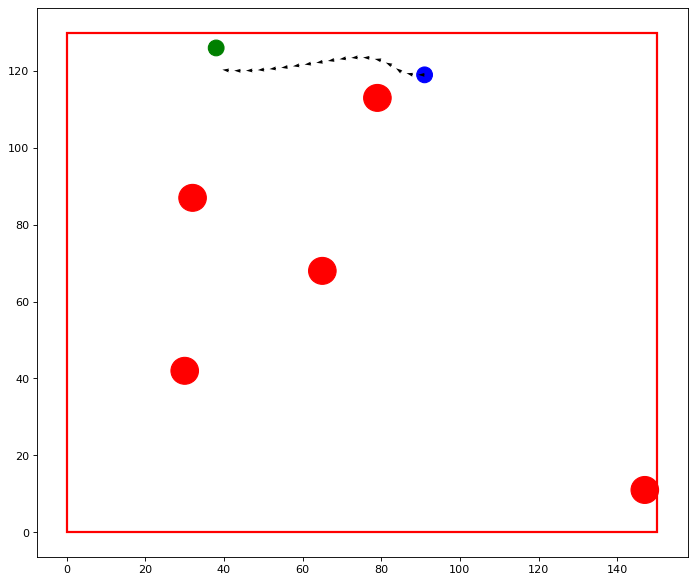

## Univector para navegação de robôs

Repositório destinado a refatorar e testar a implementação do algoritmo Univector utilizado pela equipe Ararabots.

## Instalação

'''
git clone --recursive https://github.com/kenzosakiyama/univector.git
'''

Os scripts utilizam apenas módulos nativos do Python (para versões >=3.6).